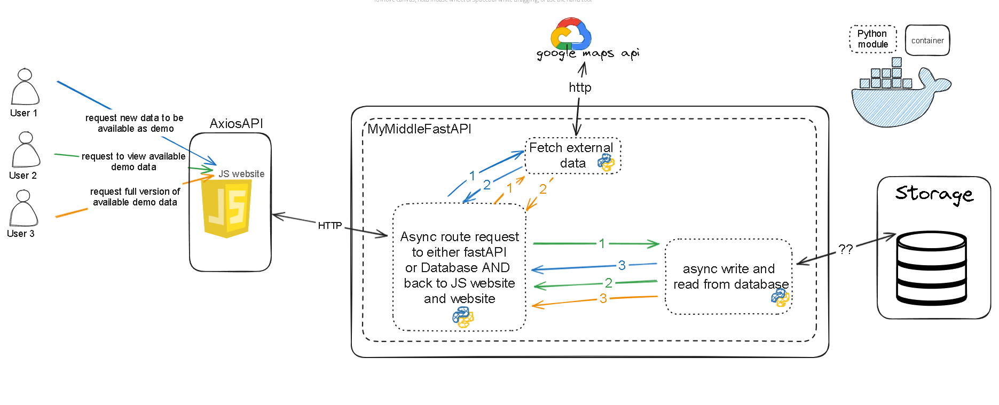

# s_locator

s_locator is a project designed to provide a seamless integration of frontend, backend, and middle API components using Docker containers. The project uses various technologies to ensure efficient data management and API interaction.

## Project Structure

```
s_locator/
├── .gitignore
├── docker-compose.yml
├── Backend/
│   └── storage/
│       ├── data_40.712776_-74.005974.json
├── FrontEnd/
│   ├── Dockerfile
│   ├── package.json
│   ├── webpack.config.js
│   ├── dist/
│   └── src/
│       ├── index.html
│       └── index.js
├── Nginx/
│   ├── Dockerfile
│   └── nginx.conf
└── my_middle_API/
    ├── Dockerfile
    ├── common_settings.json
    ├── config_factory.py
    ├── data_fetcher.py
    ├── data_types.py
    ├── fastapi_app.py
    ├── google_api_connector.py
    ├── requirements.txt
    ├── run_apps.py
    └── storage.py
```

## Components

### FrontEnd

Located in the `FrontEnd` directory, this component handles the client-side application.

- **Dockerfile**: Instructions to build the frontend Docker image.
- **package.json**: Contains the project's dependencies and scripts.
- **webpack.config.js**: Webpack configuration for bundling the frontend assets.
- **src/index.html**: The main HTML file.
- **src/index.js**: The main JavaScript file.

### Backend

Located in the `Backend` directory, this component is responsible for storing data.

- **storage/data_40.712776_-74.005974.json**: Example data file in JSON format.

### Nginx

Located in the `Nginx` directory, this component configures the Nginx server.

- **Dockerfile**: Instructions to build the Nginx Docker image.
- **nginx.conf**: Nginx configuration file.

### my_middle_API

Located in the `my_middle_API` directory, this component acts as the middle layer API.

- **Dockerfile**: Instructions to build the middle API Docker image.
- **common_settings.json**: Common settings for the API.
- **config_factory.py**: Configuration factory script.
- **data_fetcher.py**: Script to fetch data.
- **data_types.py**: Data type definitions.
- **fastapi_app.py**: FastAPI application script.
- **google_api_connector.py**: Script to connect to Google API.
- **requirements.txt**: Python dependencies.
- **run_apps.py**: Script to run the applications.
- **storage.py**: Script to handle storage operations.

## Getting Started

### Prerequisites

- Docker
- Docker Compose

### Installation

1. Clone the repository:

```bash
git clone https://github.com/abdullahalhoothy/s_locator.git
cd s_locator
```

2. Build and run the Docker containers:

```bash
docker-compose up --build
```

## Usage

- The frontend application will be available at `http://localhost:9000`.
- The backend data can be managed within the `Backend/storage` directory.
- The middle API can be accessed via `http://localhost:8000`.

## Diagram



## Contributing

Contributions are welcome! Please fork the repository and submit a pull request.

## License

This project is licensed under the MIT License.
